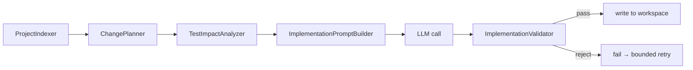

# 02 — Agent Orchestration

This document covers the orchestration mechanics in depth: the engine's routing logic, the retry mechanism, guardrails, human approval gates, and every agent's individual responsibility and failure handling.

## 1. WorkflowEngine — Routing, Not Scripting

`WorkflowEngine` is a routing table over `Stage` transitions, not a `node1 → node2 → node3` script. Its core loop:

```java
private void runUntilPaused(WorkflowState state) {
    while (state.getStatus() == RunStatus.RUNNING) {
        advanceOneStage(state);
    }
}
```

`advanceOneStage` executes the current stage's `WorkflowNode`, wraps any thrown exception as a `FAILURE` `StageResult` (so a node crashing never crashes the run), logs the outcome via `AuditLogger`, and dispatches on `NodeOutcome`:

| Outcome | Handling |
|---|---|
| `SUCCESS` | If the stage is a gate, pause (`PENDING_APPROVAL`). Otherwise advance to the next stage in `PIPELINE_ORDER`. |
| `FAILURE` | If the stage is `TESTING` or `IMPLEMENTATION`, enter the bounded retry logic (below). Any other stage failing is a **hard stop** — `Stage.FAILED`, no silent partial progress. |
| `BLOCKED` | Set `blockedStage`, pause at `RunStatus.BLOCKED`. |

`runUntilPaused` is invoked synchronously inside every `startRun` / `approveGate` / `resolveBlock` call — a single HTTP request can cascade through several non-gate stages (e.g. approving `ARCHITECTURE` can carry the run all the way to a `RELEASE`-pending pause, running `IMPLEMENTATION` → `TESTING` → `GUARDRAILS` → `DOCUMENTATION` in between) before the response returns.

## 2. Human Approval Gates

`Stage.isGate()` is true for `REQUIREMENTS`, `ARCHITECTURE`, and `RELEASE`. When a gate stage succeeds, the engine does **not** advance — it records `pendingGateStage` and sets `RunStatus.PENDING_APPROVAL`, and only `POST /runs/{id}/approve` can move it forward.

```java
public WorkflowState approveGate(WorkflowState state, String approvedBy, String notes) {
    if (state.getStatus() != RunStatus.PENDING_APPROVAL) {
        throw new IllegalStateException(...); // → HTTP 409, not a raw 500
    }
    ...
    state.setCurrentStage(nextStageAfter(gate));
    state.setStatus(RunStatus.RUNNING);
    runUntilPaused(state);
    return state;
}
```

**Dynamic re-planning on the `ARCHITECTURE` gate.** If `ArchitectureAgent` deferred its design pending clarification (empty `impactedFiles`, non-empty `clarificationQuestions` — see §4), approving that gate with non-blank `notes` is treated as the human's answer: the engine appends it to `clarificationAnswers` and **re-runs `ARCHITECTURE`** instead of blindly advancing with an empty design. This is the one place a gate approval can loop back rather than move forward, and it is exactly how [Scenario 3 — Ambiguous](03-Workflow-Scenarios.md#scenario-3--ambiguous) resolves a genuinely underspecified request.

A guardrail block is resolved the same way structurally (`POST /runs/{id}/resolve-block`), but requires `RunStatus.BLOCKED`, not `PENDING_APPROVAL` — the two states are deliberately distinct so a blocked run can never be waved through by the wrong endpoint.

Both `approve` and `resolve-block` translate an out-of-state call (e.g. approving a run that isn't pending) into `HTTP 409 Conflict` with a clear message, rather than leaking a raw, unhandled `500`.

## 3. Retry Mechanism — Two Distinct Layers

There are **two independent retry mechanisms** in this system, solving two different problems. Conflating them was an early bug (see [Design Decisions §7](04-Design-Decisions.md)); keeping them separate is a deliberate design choice.

### 3.1 Workflow-level bounded retry — "the plan was wrong"

When `TESTING` or `IMPLEMENTATION` fails, `WorkflowEngine.handleFailure` checks the current retry count **before** incrementing it:

```java
if (current == Stage.TESTING || current == Stage.IMPLEMENTATION) {
    if (state.retriesFor(Stage.IMPLEMENTATION) >= MAX_IMPLEMENTATION_RETRIES) {
        // exhausted — roll back and stop, do NOT increment further
        state.setCurrentStage(Stage.ROLLED_BACK);
        state.setStatus(RunStatus.FAILED);
        return;
    }
    int attempt = state.incrementRetry(Stage.IMPLEMENTATION);
    ...
    state.setCurrentStage(Stage.IMPLEMENTATION);
}
```

`MAX_IMPLEMENTATION_RETRIES = 2` means at most 2 retries (3 total `IMPLEMENTATION` attempts) before a safe stop. The retry counter is checked-then-incremented, so it converges exactly at the bound — it never overshoots to 3.

Each retry carries context forward via `buildPriorFailureContext()`: the previous validation-rejection message or compiler/test output is prepended to the next `IMPLEMENTATION` prompt as *"A PREVIOUS ATTEMPT FAILED — fix this without discarding what already works."* This is what makes it a retry with feedback, not a blind re-roll.

### 3.2 LLM-client-level backoff — "the provider is momentarily throttling us"

A transient `HTTP 429` from the LLM provider is a completely different failure mode: it has nothing to do with plan quality and would, if left to the workflow retry alone, burn through the entire retry budget in milliseconds (two rapid workflow retries reliably land inside the same one-minute rate-limit window). `LlmRetrySupport.callWithBackoff()` wraps the actual provider call in both `GroqLlmClient` and `AnthropicLlmClient`:

```java
static String callWithBackoff(Supplier<String> call) {
    for (int attempt = 0; attempt < MAX_ATTEMPTS; attempt++) {
        try {
            return call.get();
        } catch (RuntimeException e) {
            if (!isTransientRateLimit(e) || attempt == MAX_ATTEMPTS - 1) throw e;
            sleep(BASE_BACKOFF_MS * (attempt + 1)); // 2s, then 4s
        }
    }
    ...
}
```

This layer is invisible to `WorkflowEngine` — from the engine's point of view, a call that succeeded after one internal backoff simply succeeded. Only a *persistent* provider failure (or a genuine bad-plan failure) ever reaches the workflow-level retry logic.

## 4. Guardrails

`GuardrailAgent` performs real static analysis — regex-based, not an LLM opinion — on the files `ImplementationAgent` actually wrote in this run's workspace. Two layers:

**Content-pattern rules**, applied to changed files only:

| Rule | Catches |
|---|---|
| `hardcoded-secret` | `password`/`apiKey`/`secret` assigned a literal string |
| `aws-access-key` | AWS access-key-shaped strings (`AKIA[0-9A-Z]{16}`) |
| `embedded-private-key` | A PEM private-key block pasted into source |
| `raw-ip-persistence` | `getRemoteAddr()` calls — project policy: don't persist raw client IPs unhashed |

**Whole-tree structural checks**, a second line of defense beyond `ImplementationValidator`'s per-file diffing:
- Duplicate `@Entity`/`@Repository`/`@Service`/`@RestController`/`@Controller` class names anywhere in the workspace (catches cross-file duplication a single-file diff can't see).
- Declared package vs. directory path mismatch on any changed `src/main/java/**` file.

A violation returns `NodeOutcome.BLOCKED`. The engine routes this to `RunStatus.BLOCKED` — a state distinct from `FAILED`, signaling "fixable by a human, not a dead end." Only `POST /runs/{id}/resolve-block` clears it, and clearing it resumes the pipeline from the stage *after* `GUARDRAILS`, not from the beginning.

Guardrails are deliberately regex-based (see [05-Limitations.md](05-Limitations.md)) — adequate to demonstrate the blocking mechanic reliably and reproducibly, not a production-grade SAST/secret-scanning integration.

## 5. Reliability Metrics & Audit Trail

`AuditLogger.logStageExecution()` fires after every node execution, appending a `DecisionRecord` to `WorkflowState.decisionLog` **and** emitting a structured SLF4J line (`AUDIT` logger) — queryable via a real log aggregator in a production deployment. `logHumanDecision()` does the same for every `approve`/`resolve-block` call.

`GET /runs/{id}/metrics` (`MetricsCollector`) computes, from the same decision log — no separate bookkeeping to drift out of sync:

| Metric | Definition |
|---|---|
| `totalDurationMs` | Wall-clock from `startedAt` to `updatedAt` |
| `totalRetries` | Sum of retry counts across all stages |
| `gatesPassed` | Count of human `approve` decisions recorded on gate stages |
| `mttrMs` | Mean time between a `[FAILURE`/`[BLOCKED` log entry and the very next decision (retry kicking in, or a human resolving) |
| `stageDurationsMs` | Per-stage cumulative execution time |

## 6. Agent Catalog

Every agent is a `@Service` implementing `WorkflowNode { Stage stage(); StageResult execute(WorkflowState state); }`.

### 6.1 RequirementsAgent
LLM call. Produces `RequirementSpec` (functional / non-functional requirements, acceptance criteria, ambiguities, clarification questions, assumptions). Explicitly instructed **not** to silently resolve ambiguity with an assumption — genuine ambiguity goes into `clarificationQuestions` for a human to answer, even on a `GREENFIELD`/`BROWNFIELD` request, not only when `scenarioType == AMBIGUOUS`.

### 6.2 ArchitectureAgent
LLM call, but with **three distinct system prompts** selected by scenario type (greenfield / brownfield / ambiguous), rather than one generic prompt asked to "figure out" which mode it's in:
- **Greenfield**: design a new application; no existing codebase referenced.
- **Brownfield**: reads the real product source tree (`CodebaseContextService.summarizeSourceTree()`) and is instructed to prefer `MODIFY` over `CREATE` whenever a plausible existing owner exists.
- **Ambiguous**: does not attempt a design at all — returns `clarificationQuestions` only, explicitly to avoid producing throwaway work against an underspecified ask.

Once a human answers a clarification (`clarified = true`), the agent always designs with real codebase context (the brownfield prompt), even if the original scenario was `AMBIGUOUS` — a safer default than guessing greenfield. The "deferred" vs. "produced" decision-log line is driven purely by whether *this specific* result has a non-empty `impactedFiles`, not by the original scenario type.

### 6.3 ImplementationAgent — the deep pipeline
The only LLM call here is bracketed by a deterministic pipeline that decides *what* the model may touch and validates *what it returned*, before a single byte is written:



1. **`ProjectIndexer`** scans the workspace's `src/main/java` tree once and builds a `ProjectIndex` (per-class package, kind, superclass/interfaces, public methods, REST endpoint mappings, repository methods) via `JavaSourceAnalysis` — a deliberately regex-based extractor, not a real parser (documented trade-off, see [05-Limitations.md](05-Limitations.md)).
2. **`ChangePlanner`** resolves Architecture's per-file `CREATE`/`MODIFY` hint against the real index — the LLM's own opinion never overrides this. Three outcomes per proposed file:
   - Exact path already exists → `MODIFY`.
   - No exact path, but **`ClassNameEquivalence`** finds a same-role class under a different name (e.g. Architecture asks for `UrlShortenerService` when `ShortenerService` already exists) → `MODIFY`, redirected to the real file.
   - No match at all → `CREATE`.
   `ClassNameEquivalence` tokenizes camelCase names, strips filler words (`url`/`api`/`rest`/`web`) and role suffixes (`Service`/`Controller`/`Repository`/…), and matches on the remaining core tokens — exact set match, or (only when **both** names reduce to a single token) a substring check, to catch "Short vs. Shortener" without also conflating unrelated multi-token names that happen to share one word fragment.
3. **`TestImpactAnalyzer`** — for every `MODIFY` decision, discovers existing test files impacted by that change, via two unioned signals: naming convention (`Foo.java` → `FooTest`/`FooTests`/`FooIT`/`FooIntegrationTest`) and content reference (any test file importing or using the changed class's simple name). This closes what would otherwise be a structural blind spot: without it, Implementation has zero visibility into `src/test/**`, so a change that alters a public constructor/method signature silently breaks an existing test it never knew existed (see [Design Decisions §8](04-Design-Decisions.md) for the full rationale).
4. **`ImplementationPromptBuilder`** builds a prompt that names the exact files to `CREATE`/`MODIFY` (with full current content only for `MODIFY` targets, kept bounded to only the files actually in scope), a dedicated section for impacted test files with explicit instructions to fix only what's necessary and preserve existing test intent, and the prior-attempt failure context on retries.
5. **`ImplementationValidator`** runs *before* any write: rejects a plan that silently drops an existing REST mapping, public/interface method, or `@Test` method; rejects a plan that reintroduces a duplicate class under a new name; rejects a plan that adds a duplicate REST endpoint colliding with an existing, un-touched class; checks package-vs-path and a small set of common missing-import cases. The "did we silently drop something" check always diffs against the **untouched live product file** (`WorkspaceService.readLiveProductFile`), never against a previous (possibly still-broken) retry attempt's workspace state — otherwise a legitimate rewrite on retry 2 could be wrongly penalized for "removing" something retry 1 only speculatively added.
6. Only after validation passes does the agent write into the workspace (never the live product root).

### 6.4 TestAgent
Runs `./gradlew :shortener-service:compileJava` then `:shortener-service:test` as a real subprocess inside the run's isolated workspace, bounded by a 180s timeout (force-killed on expiry, reported as failure rather than hanging the run forever). Distinguishes `COMPILE FAILURE` from `TEST FAILURE` in the notes fed back to `ImplementationAgent` on retry. Includes an explicit, clearly-labeled demo trigger (`DEMO_RETRY_TRIGGER` in the raw requirement text) that forces two synthetic failures before allowing the real Gradle run through — makes the bounded-retry path reproducible on demand rather than dependent on an LLM misbehaving on cue.

### 6.5 GuardrailAgent
See §4.

### 6.6 DocsAgent
Deliberately **not** an LLM call — every field it renders already exists as structured data on `WorkflowState`, so templating it into `run-artifacts/{runId}/SUMMARY.md` is strictly more reliable than asking a model to paraphrase it back correctly. Writes to the run's own artifact directory, never the product's real README, so repeated runs never clobber each other or the real docs.

### 6.7 ReleaseAgent
Also deterministic: a checklist built from the run's actual recorded outcomes (tests passed, guardrails passed, docs generated, retries used, ambiguities flagged) — not an LLM opinion on whether things "seem fine." `RELEASE` is itself a gate, so even an all-green checklist still stops for a human's final sign-off before `COMPLETED`.

## 7. Cross-References

- Real evidence of every mechanic in this document actually firing on a live run: [03-Workflow-Scenarios.md](03-Workflow-Scenarios.md).
- Why these specific boundaries (workflow retry vs. LLM backoff, live-file vs. workspace diffing, etc.) were chosen: [04-Design-Decisions.md](04-Design-Decisions.md).
- What's intentionally out of scope for this submission: [05-Limitations.md](05-Limitations.md).
