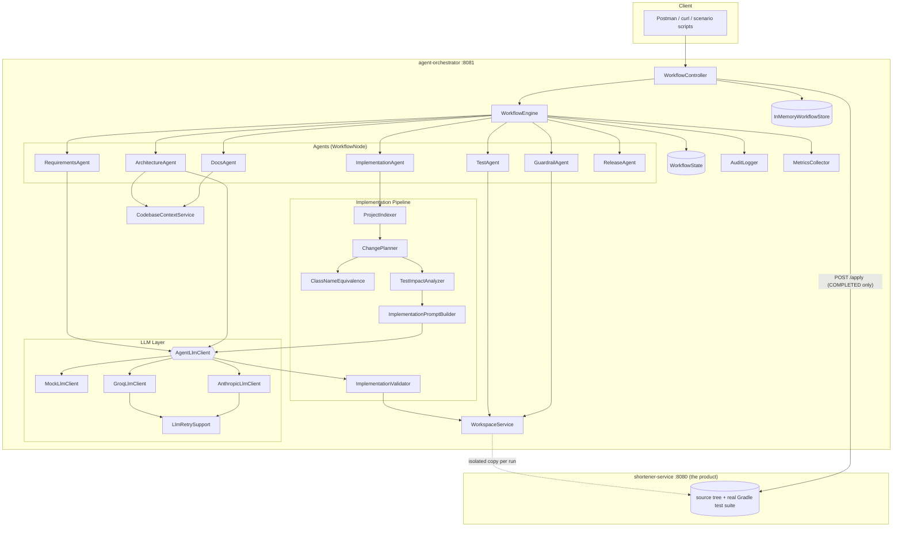
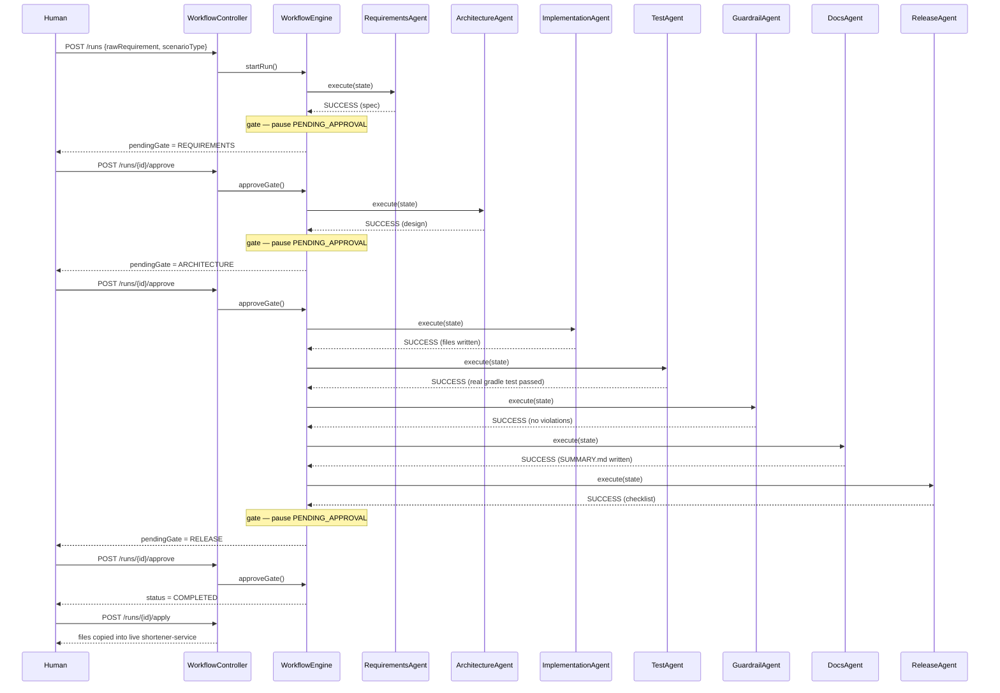
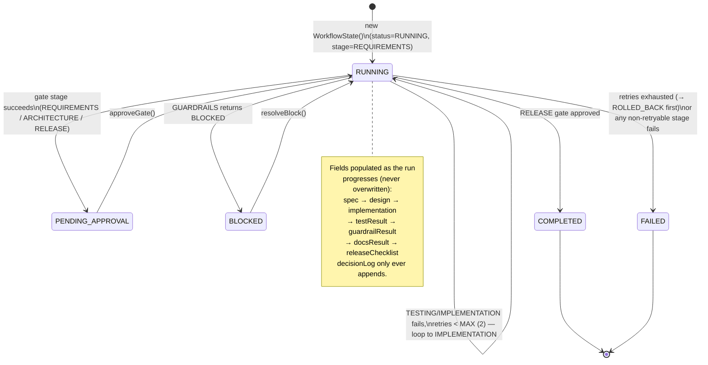
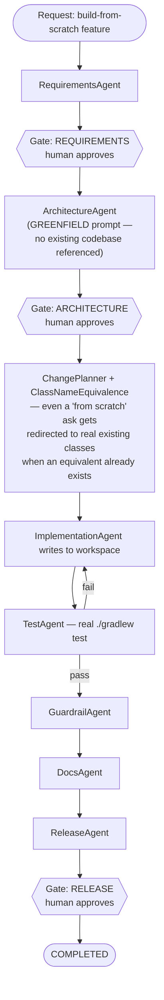
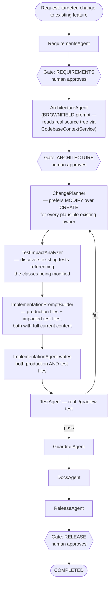
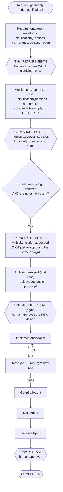
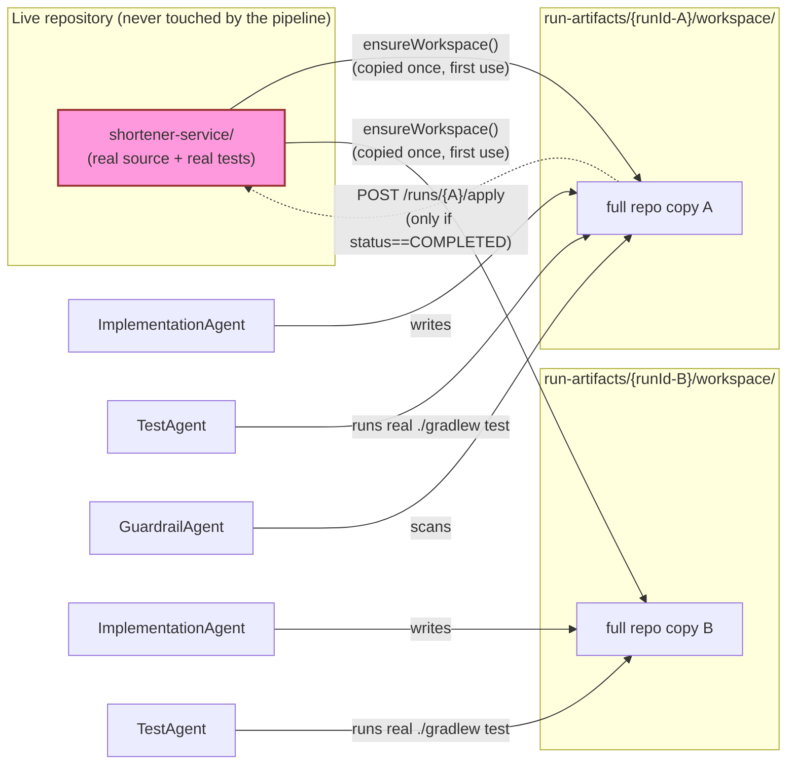
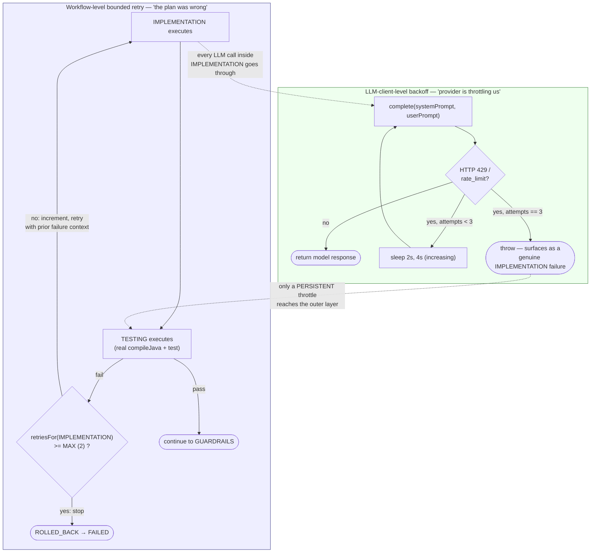
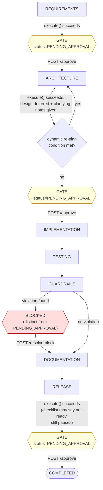

# 06 — Diagrams

A consolidated visual reference for the system. Each diagram is intentionally self-contained with a short caption — for the full narrative behind any of them, see [01-Architecture.md](01-Architecture.md), [02-Agent-Orchestration.md](02-Agent-Orchestration.md), or [03-Workflow-Scenarios.md](03-Workflow-Scenarios.md).

## 1. Overall System Architecture

**Caption:** the orchestrator never depends on the product as a library — it reads/writes its source tree as data and shells out to run its real test suite. Every agent reaches the LLM only through one interface; only `ImplementationAgent` has an internal deterministic pipeline around its single model call.

---

## 2. Workflow Sequence (Happy Path)

**Caption:** one HTTP request can cascade through several non-gate stages before returning — approving `ARCHITECTURE` here carries the run all the way to the `RELEASE` gate in a single call.

---

## 3. WorkflowState Lifecycle

**Caption:** `WorkflowState` itself never resets — `RunStatus` cycles between `RUNNING` and a paused state (`PENDING_APPROVAL` or `BLOCKED`) until it reaches a terminal state. `Stage` (not shown here — see [02-Agent-Orchestration.md](02-Agent-Orchestration.md)) tracks *which* node runs next; `RunStatus` tracks *whether* the engine is currently allowed to run one.

---

## 4. Greenfield Execution Flow

**Caption:** evidenced by [Scenario 1](03-Workflow-Scenarios.md#scenario-1--greenfield) — the real run redirected 2 of 5 "new" files to existing equivalents rather than duplicating them, entirely via deterministic planning, before the LLM ever wrote a line of code.

---

## 5. Brownfield Execution Flow

**Caption:** evidenced by [Scenario 2](03-Workflow-Scenarios.md#scenario-2--brownfield) — adding a field to `ShortenRequest` changes its constructor shape and breaks the pre-existing integration test's positional call; `TestImpactAnalyzer` is what lets that test get fixed in the *same* attempt as the production change, rather than failing blind at `TESTING`.

---

## 6. Ambiguous Execution Flow

**Caption:** evidenced by [Scenario 3](03-Workflow-Scenarios.md#scenario-3--ambiguous) — this is the only path in the whole graph where a gate approval can loop *backward* (re-run `ARCHITECTURE`) instead of only ever advancing forward, and it requires **two** separate `ARCHITECTURE` approvals to reach `RELEASE`.

---

## 7. Workspace Isolation ("Patch, Don't Auto-Write")

**Caption:** two runs (even concurrent ones) never see each other's writes and never touch the real product. Only a `COMPLETED` run's files can ever cross the boundary back into `LiveProduct`, via one explicit, gated endpoint — a bad or half-finished run in `CopyB` has zero ability to affect `CopyA` or the live tree, no matter how many retries it takes.

---

## 8. Retry Mechanism (Two Independent Layers)

**Caption:** the two layers never share a counter. A transient `429` is absorbed invisibly inside a single `IMPLEMENTATION` attempt; only a genuinely bad plan (or a provider failure that outlasts the backoff) ever consumes one of the two workflow-level retry attempts.

---

## 9. Human Approval Gates

**Caption:** three gates (`REQUIREMENTS`, `ARCHITECTURE`, `RELEASE`) always pause for an explicit `approve` call; `BLOCKED` is a structurally distinct pause reachable only from `GUARDRAILS` and cleared only by `resolve-block` — the two mechanisms use different endpoints and different status values on purpose, so a blocked run can never be waved through by the wrong call.
