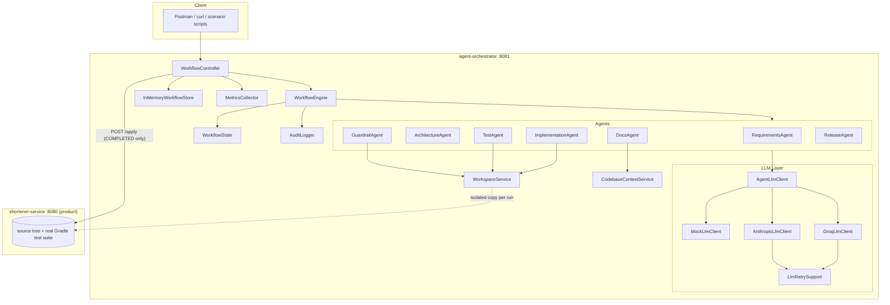
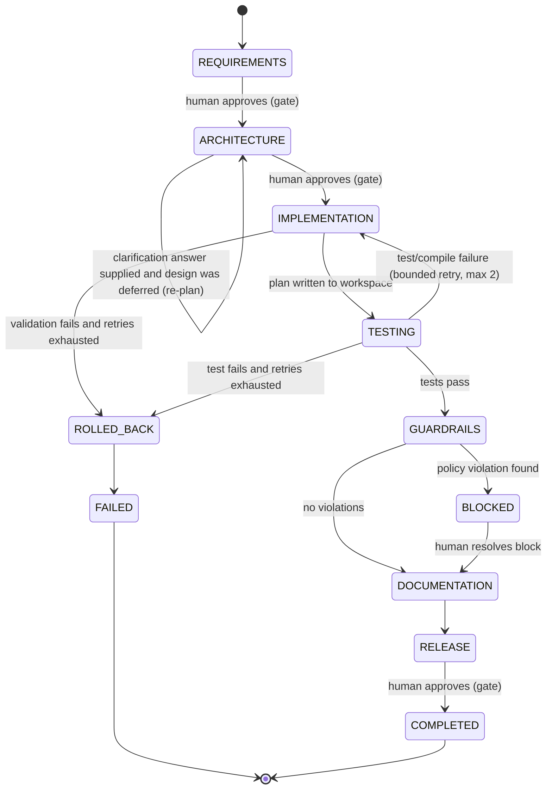
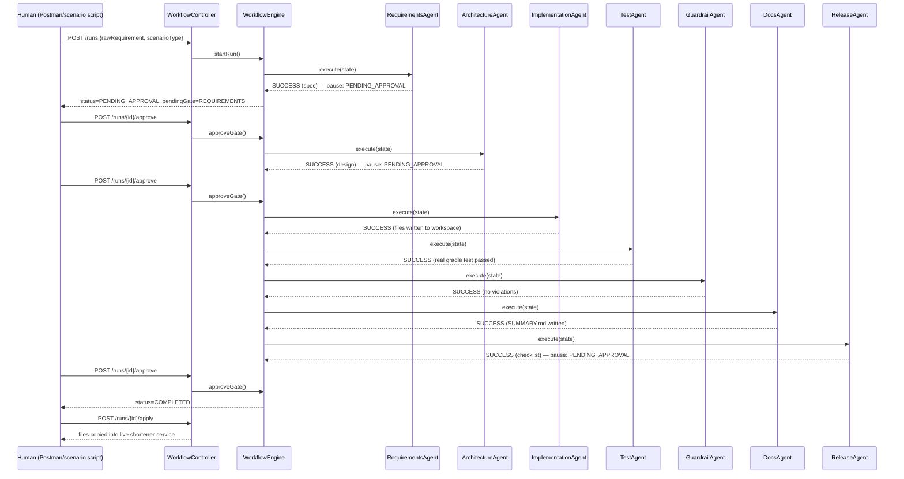

# 01 — Architecture

## 1. System Overview

This repository contains two independently runnable Spring Boot applications in one Gradle multi-module build:

| Module | Role | Port |
|---|---|---|
| `shortener-service` | The product — a URL shortener REST API (create, redirect, stats) | 8080 |
| `agent-orchestrator` | The agentic SDLC orchestration layer that designs, implements, tests, and releases changes to the product | 8081 |

`agent-orchestrator` treats `shortener-service` as **data, not a dependency** — it never imports the product's classes. Instead it reads the product's source tree as text, writes files into it, and shells out to run its real Gradle test suite as a subprocess. This is a deliberate boundary: the orchestrator's job is to *operate on* a codebase, so it is built to work on any Java/Spring Boot project laid out conventionally, not tightly coupled to this one.

```
url-shortener-agentic/
  shortener-service/       the product
  agent-orchestrator/      the orchestration layer
  scenarios/                reproducible demo scripts for the 4 required scenarios
  run-artifacts/            generated per-run: isolated workspaces + run summaries
  docs/                     this documentation set
```

## 2. Component Map



## 3. Package Responsibilities

| Package | Responsibility |
|---|---|
| `state` | `WorkflowState` — the single mutable context object carried across a run; `Stage`/`RunStatus`/`Actor`/`ScenarioType` enums; `DecisionRecord` — one immutable audit-log entry |
| `graph` | `WorkflowNode` interface; `WorkflowEngine` — the routing/governance layer; `StageResult`/`NodeOutcome` |
| `agents` | One `@Service` per SDLC stage, each a `WorkflowNode` implementation |
| `implementation` | The internal pipeline `ImplementationAgent` runs before/after its single LLM call: `ProjectIndexer`, `ChangePlanner`, `ClassNameEquivalence`, `TestImpactAnalyzer`, `ImplementationPromptBuilder`, `ImplementationValidator`, `JavaSourceAnalysis` |
| `llm` | `AgentLlmClient` abstraction with three implementations (`MockLlmClient`, `GroqLlmClient`, `AnthropicLlmClient`) selected by `app.llm.mode`; `LlmRetrySupport` (transient-throttle backoff); `JsonExtractionUtil` |
| `codebase` | `WorkspaceService` (per-run isolated workspace) and `CodebaseContextService` (scoped read/write into the live product tree, and the sandbox used for run artifacts) |
| `audit` | `AuditLogger` — writes every stage transition and human decision to both the run's decision log and structured SLF4J output |
| `metrics` | `MetricsCollector` / `RunMetrics` — retry counts, gates passed, MTTR, per-stage duration |
| `controller` | `WorkflowController` — the REST surface; `dto` — request/response shapes |
| `repository` | `InMemoryWorkflowStore` — the run store (see [05-Limitations](05-Limitations.md)) |

## 4. The Stage Graph

`Stage` is not a linear pipeline — it is a directed graph with three non-linear behaviors:



- **Gates** (`REQUIREMENTS`, `ARCHITECTURE`, `RELEASE`) pause the engine at `RunStatus.PENDING_APPROVAL`. Nothing proceeds until a human calls `POST /runs/{id}/approve`.
- **Bounded retry edge**: a `TESTING` or `IMPLEMENTATION` failure routes back to `IMPLEMENTATION`, up to `MAX_IMPLEMENTATION_RETRIES = 2` times, carrying the failure reason forward so each retry attempt has context. Exceeding the bound routes to `ROLLED_BACK` → `FAILED` — a safe stop, never an infinite loop.
- **Block edge**: a `GUARDRAILS` violation routes to `BLOCKED`, a distinct state that only an explicit `POST /runs/{id}/resolve-block` can clear — it cannot be silently bypassed by a later stage running anyway.

Full mechanics (exact retry semantics, gate/approve lifecycle, guardrail rule catalog) are covered in [02-Agent-Orchestration.md](02-Agent-Orchestration.md).

## 5. WorkflowState — Decision Lineage

Every agent reads from and writes to one `WorkflowState` instance per run. Two structural choices make the run auditable end-to-end:

- **Append-only decision log.** `addDecision(stage, actor, summary)` only ever appends; nothing is overwritten. `GET /runs/{id}/audit` returns the complete, ordered history of every system decision (what an agent produced) and every human decision (who approved what, when, with what notes).
- **One object, one lineage.** `RequirementSpec` → `ArchitectureDesign` → `ImplementationResult` → `TestResult` → `GuardrailResult` → `DocsResult` → `ReleaseChecklist` all live on the same `WorkflowState`, so any later stage (or a human reviewing `GET /runs/{id}`) can see the full requirement-to-release chain for that run, not just the current stage's output.

## 6. Workspace Isolation — "Patch, Don't Auto-Write"

Every run gets its own copy of the whole repository under `run-artifacts/{runId}/workspace/`. `ImplementationAgent` writes there, `TestAgent` runs `./gradlew test` there, `GuardrailAgent` scans there — **the live `shortener-service` module is never touched by the automated pipeline.**

The only path that ever mutates the real product is `POST /runs/{id}/apply`, and it is guarded twice:
1. It only proceeds if `state.getStatus() == RunStatus.COMPLETED` — every gate, including the final `RELEASE` gate, must have been approved by a human.
2. `WorkspaceService.applyToLiveProduct()` resolves every target path and verifies it stays within the live product root before copying, rejecting anything that would land outside it.

This means a bad LLM generation — no matter how many retries it takes to get right, or how badly it misbehaves — can never corrupt the actual codebase. The worst case is a wasted run in an isolated directory.

`WorkspaceService.repoRoot()` is validated at application startup (`@PostConstruct`) against a known marker (`shortener-service/build.gradle`) — if the resolved root doesn't contain it, the application refuses to start with an actionable error, rather than failing silently deep inside a run many minutes later.

## 7. LLM Abstraction

Every agent talks to the model only through `AgentLlmClient.complete(systemPrompt, userPrompt)`. Three implementations, selected by `app.llm.mode`:

| Mode | Implementation | Behavior |
|---|---|---|
| `mock` (default) | `MockLlmClient` | Deterministic canned responses keyed by a `SCHEMA_ID` marker in the prompt — exercises the full graph (gates, retries, audit, metrics) with zero API cost |
| `groq` | `GroqLlmClient` | Real calls via Groq's OpenAI-compatible API (Spring AI's OpenAI starter) |
| `anthropic` | `AnthropicLlmClient` | Real calls via Claude (Spring AI's Anthropic starter) |

Swapping providers changes zero agent code. Both real-provider clients route their call through `LlmRetrySupport.callWithBackoff()` — a short, bounded backoff-and-retry specifically for transient provider throttling (HTTP 429 / rate limits), which is a **distinct concern** from the workflow-level bounded retry (see [02-Agent-Orchestration.md §Retry Mechanism](02-Agent-Orchestration.md#3-retry-mechanism-two-distinct-layers)).

`JsonExtractionUtil` strips common LLM formatting mistakes (markdown code fences, stray prose around the JSON) before every parse, so a formatting quirk doesn't fail a stage that otherwise produced a valid plan.

## 8. Sequence: A Single Run, Happy Path



See [03-Workflow-Scenarios.md](03-Workflow-Scenarios.md) for real, evidenced runs of all four required scenarios, and [02-Agent-Orchestration.md](02-Agent-Orchestration.md) for what happens off the happy path (retry, block, re-planning).
